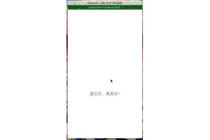

# react_native_douban_movie_list
a simple RN Demo based on douban v2 API （开发中~）

### 

React-Native + Douban V2 API

### Demo Pic:

### Run:
- Setup React Native develope environment
- Clone the project, cd into the root folder
- pen Terminal and run the following command:
- npm install
- react-native run-ios/run-android
